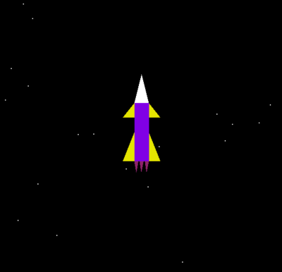
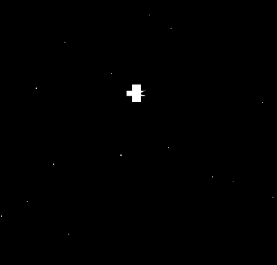
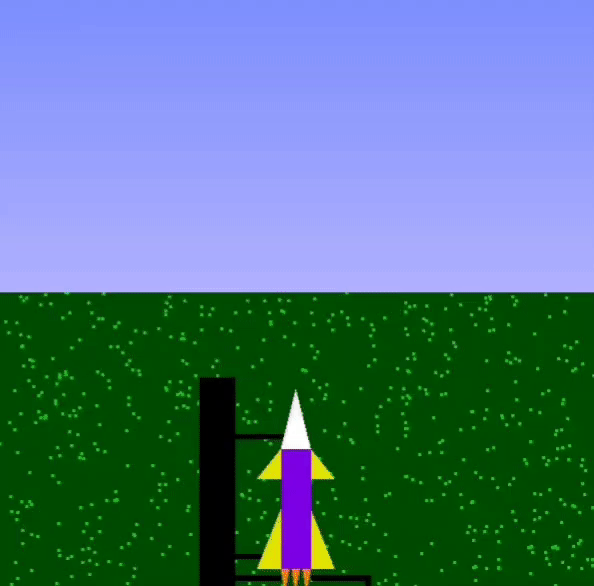

* <<<<<<< HEAD
# Escape
## Project Overview
Welcome to Escape, a captivating rocket launch simulation using OpenGL and Python! This project visualizes the thrilling process of a rocket launch, from countdown to lift-off, all the way to its journey in the sky. The simulation features a play button to initiate the countdown, realistic starry sky, moon, and detailed rocket movements.

## Features
### Play Button:
Starts the countdown for the rocket launch.

### Countdown Timer:
Displays a 3-second countdown before the rocket launch sequence begins.

### Realistic Rocket Launch:
Animates the rocket launch, including fumes and boosters.

### Starry Sky and Moon:
Creates a realistic outer space environment with stars and a moon.

### Grass and Launch Pad:
Simulates the rocket launch site with grass and a launch pad.

## Prerequisites
Before you begin, ensure you have met the following requirements:

Python 3.x
PyOpenGL
GLUT (OpenGL Utility Toolkit)

## Installation
### Clone the Repository

```
git clone https://github.com/yourusername/escape.git
cd escape
Create a Virtual Environment (Optional but Recommended)
```

~~~
python3 -m venv venv
source venv/bin/activate  # On Windows, use `venv\Scripts\activate`
~~~

### Install Dependencies
* =======

<h1 align="center">Rocket Launch Simulation</h1>
<div align="center">
  
  <h2> A 2D simulation of a rocket launch using computer graphics and visualization concepts in Opengl and python.</h2>
<h3>
  Names: Disha Shah and Hinal Pujara<br>
  Roll Nos.: 1911053 and 1911042<br>
  Course: CGV<br>
  Faculty: Vaibhav Vasani<br>
  College: KJ Somaiya college of engineering<br><br>
</h3>
</div>

<div align="center">

[](https://www.opengl.org/ "OpenGL")
[](https://www.python.org/ "Python")


</div>

<div>
<h4><b>Objective :</b></h4>

To show the simulation of rocket launch and illustrate the concept using opengl.
This project can be used for educational purposes or can also be incorporated into a game for leisure.


### <b>Snapshots of the project :</b>

<div align="center">
  







</div>  

### <b>Output of the project</b>

<div align="center">
  



</div>

## <b>To run this project :</b>

### Clone the project -
```
  $ git clone https://github.com/dishaShah01/RocketLaunchSimulation.git
```
  
### Install all the requirements -
```
 $ pip install PyOpenGL PyOpenGL_accelerate
```
#### <b>Note :</b>
The `requirements.txt` file should list all Python libraries that the project
depends on along with their versions, and they will be installed using:
* master

```
pip install -r requirements.txt
```

* <<<<<<< HEAD
### Usage
Run the Simulation

```
python escape.py
Interaction
```

Click the Play Button on the screen to start the countdown.
Observe the rocket launch sequence once the countdown reaches zero.

### File Structure
escape.py: Main script containing the simulation logic.
README.md: Project documentation.
requirements.txt: Python dependencies (optional, for pip installation).

### How It Works
#### Main Components
* Play Button: Drawn on the screen, initiates the countdown when clicked.
* Countdown: Displays a 3-second countdown timer.
* Rocket Launch: Handles the rocket's position and movement, including fumes and boosters.
* Stars and Moon: Renders stars randomly in the sky and a moving moon for a realistic effect.
* Grass and Launch Pad: Simulates the ground environment of the rocket launch site.

#### Key Functions
* draw_play_button(): Draws the play button.
* mouse_click(): Detects mouse clicks to start the countdown.
* display_countdown(): Displays the countdown timer.
* Rocket_on_Ground(): Renders the rocket on the ground before launch.
* Moving_Rocket(): Animates the rocket's movement in the sky.
* stars(), moon(), grass(): Render the sky elements.

## Contributing
Contributions are always welcome!

### To contribute:

Fork the repository.
Create a new branch (git checkout -b feature/your-feature).
Make your changes.
Commit your changes (git commit -m 'Add some feature').
Push to the branch (git push origin feature/your-feature).
Open a Pull Request.

## License
This project is licensed under the MIT License. See the LICENSE file for details.

## Contact
If you have any questions or suggestions, feel free to reach out:

##### Email: rk26071320@student.ku.edu.np /n
##### GitHub: reewajkhanalrk10
Enjoy the simulation, and happy coding! 🚀


* =======
Start the project, navigate to the project directory on the terminal;
 ### Run the script -
 for linux/mac :
```
  $ python Rocket_launch.py
```  
 for windows :
``` 
  $ python Rocket_launch.py
```

<h4>
<b>
Scope :
</b>
</h4>
<ul>
<li>The project provides a comprehensive simulation of how the rocket launch takes place on earth and the various stages the rocket goes through after the launch.</li>
<li>This is purely a 2D graphic animation.</li>
<li>Any type of controlling systems is not used in this project.</li>
</ul>
</div>

 #### <b>Features to be added :</b>
- Keyboard controls to make it dynamic.
- Create a 3D version. 

---

#### <div align="center">If you have any improvements create an issue and if you want you can also make a pull request for the same. </div>

---


---
<h3 align="center"><b>Developed by <a href="https://github.com/dishaShah01">Disha Shah</a> & <a href="https://github.com/hinalpujara">Hinal Pujara</a></b></h1>
* master

